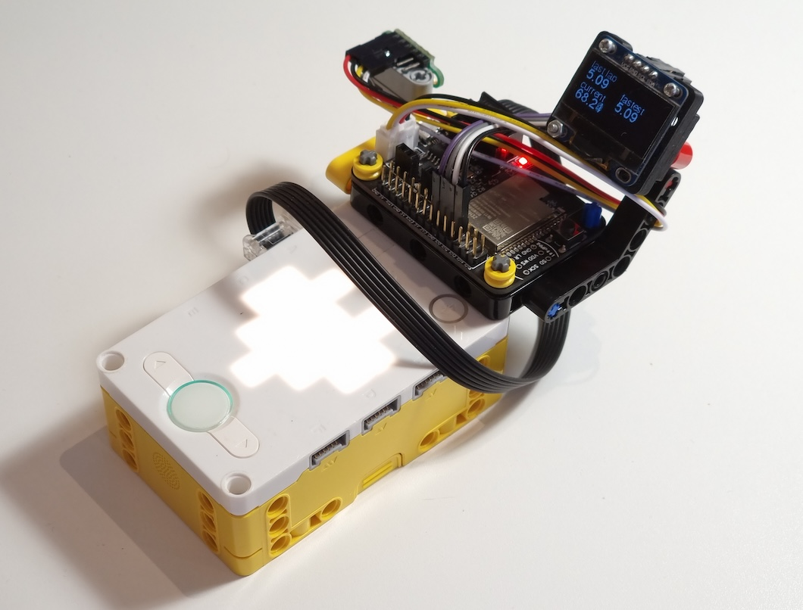

LMS-ESP32 Laptimer
------------------

This lap timer combines a $1.5 ssd1306 display with a $1.5 laser rangefinder to function as 
a gate for race vehicles to pass through. It triggers when it sees something closer than 65% of the average range.

Copy all files to [LMS-ESP32](https://www.antonsmindstorms.com/product/wifi-python-esp32-board-for-mindstorms/) to run. Check main.py for pin numbers and wiring.

